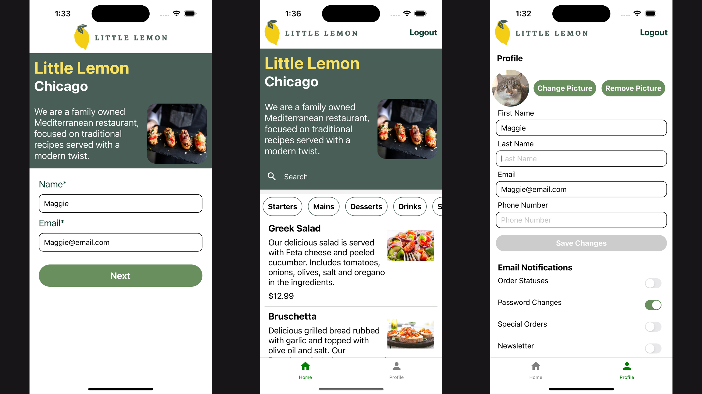

# Little Lemon Restaurant App

The **Little Lemon Restaurant App** is a React Native Expo application developed as part of the Meta React Native Course on Coursera.

## Features

- **User Registration**: Users need to register with their name and email when they first open the app.
- **Home Screen**: Displays the restaurant menu. Users can search for specific dishes using the search bar and filter the menu by categories.
- **Profile Screen**: Users can update their name and email, add a last name, phone number, and profile picture. They can also manage their email notifications.

## Installation

To install and run the app locally, follow these steps:

1. Clone the repository:
   ```bash
   git clone git@github.com:ingridmidia/little-lemon-react-native.git

2. Navigate to the project directory:
   ```bash
   cd little-lemon-restaurant-app


3. Install the dependencies:
   ```bash
   npm install

4. Start the Expo development server:
   ```bash
   npm start


